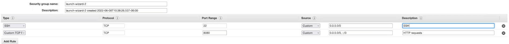
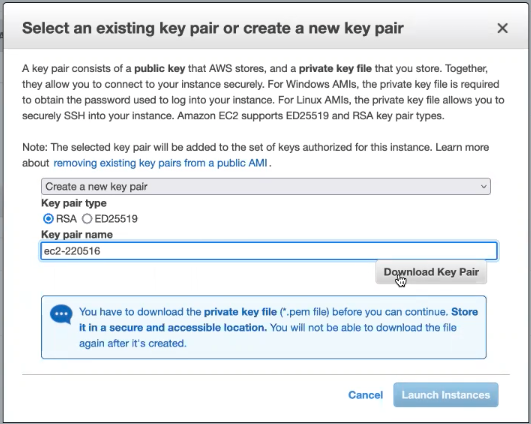

# ec2-guide

## Index
1. [Pre-req](##pre-req)
2. Create EC2 Instance
3. SSH into EC2 Instance
4. Credits
---

## Pre-req
Some info that is nice to know.

### What is EC2

Amazon Elastic Compute Cloud is a part of Amazon.com's cloud-computing platform, 
Amazon Web Services (AWS), that allows users to rent virtual computers on which to run their 
own computer applications. EC2 encourages scalable deployment of applications by providing a web service
through which a user can boot an Amazon Machine Image (AMI) to configure a virtual machine, which Amazon calls an 
"instance", containing any software desired.

### What is SSH

Secure Shell Protocol (SSH) is a cryptographic network protocol for operating network services 
securely over an unsecured network. Its most notable applications are remote login and command-line execution.

### TLDR

EC2 is a virtual computer where you can delpoy your web apps, and ssh is a protocol that
allows you to access you EC2 instance (computer) with the help of a key (.pem file).

## Create EC2 Instance

### Step 1 Launch instance

Go to EC2 page by first searching in aws search bar `EC2`.

Next click the button that says `Launch Instance`


### Step 2 Select AMI

Because we are broke we will choose only free options.

Choose Amazon-Linux 2 Kernal 5.10


### Step 3 Select Instance

Select t2.mico


### Step 4-5 Add Storage/Add Tags

You can leave the `Add Storage` and `Add Tags` tabs as default.

### Step 6 *(Optional) Add Security Group*

If you want you can allow tcp connections on port 8080 yo do this:

click `Add Rule`

**Type:** `Custom TCP`
**Port Range:** `8080`



### Step 7 Review and get .pem file

You can click `Launch` in the bottom right corner.

You will be prompted by a window where you asked to create a pem key.

Name you key for this demo we will name it `ec2-220516`

click `Download Key Pair`



**Congrats you have finished creating an EC2 Instance**

## SSH into EC2 Instance

### Pre-req

#### Get ip address 
Next you have to ssh into the amazon ec2 through your terminal. Remember that ssh is a protocol
you will need to know the ip of where this instance is hosted.

This can be found in your **instance summary**


### Step one locate your pem file

Open terminal and then cd to where you pem file is.

Once the pem is in the working directory  you will have to run the code 

```bash
ssh -i {yourKeyName}.pem ec2-user@{yourIpAddress}
```

For Example with:

- **yourKeyName:** `ec2-220516`
- **yourIpAddress:** `54.241.186.217`

your bash prompt will be:

```bash
ssh -i ec2-220516.pem ec2-user@54.241.186.217
```


**Congrats you have ssh into your EC2!**


### Error 1: Auth of host cant be estblsihed


if this prompt comes up type yes.

### Error 2: key is too open Access (Key) Denied


You have to change the access permission of the key:

```bash
chmod 400 {yourKeyName}.pem
```

for example

```bash
chmod 400 ec2-220516.pem
```

## Credits
- Eric
- Will
